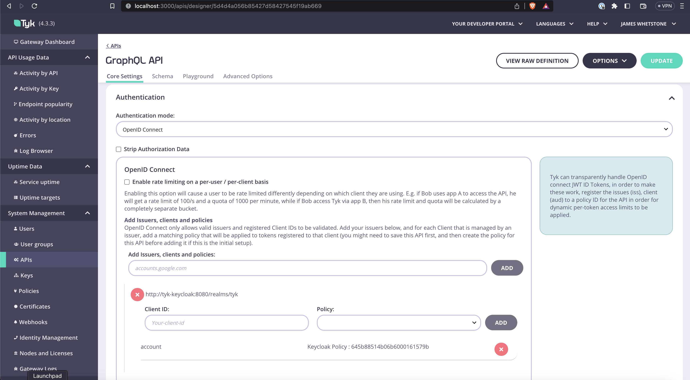

# tyk-poc
Tyk Proof Of Concept

This project is intended to show the capabitlities of the Tyk API gateway.  

The project includes 3 demo API services:
- a graph QL service in the graphql-api folder
- a node based REST service in the node-api folder
- a Spring Boot based REST service that utilizes OpenAPI v3 for documentation.

## Security

OIDC based security has been added to show how security operation.  Keycloak is the 
OIDC provider that has been incorporated in the the project. 

## Testing
A postman collection provides a simple set of API calls that can be used to test 

# How to build and use this project

Add 

`127.0.0.1      tyk-keycloak` to /etc/hosts

- build and run the node-api project from the node-api folder:
  - `npm install`
  - `node index.js` 

- build and run the Spring Boot API from the api folder
  - `mvn clean install`
  - `java -jar ./api-0.0.1-SNAPSHOT.jar`

- build and run the graphQL API from the graphql-api folder
  - `npm install`
  - `npm run dev`

- build and run the tyk project from tyc-poc
  - `git clone git@github.com:TykTechnologies/tyk-pro-docker-demo.git`
  - Copy tyk-poc/docker-compose.yml to tyk-poc/tyk-pro-docker-demo/.
  - Copy tyk-poc/environment.sh to tyk-poc/tyk-pro-docker-demo/.env
  - CD to type-pro-docker-demo
  - run `docker-compose -f docker-compose.yml -f docker-compose.mongo.yml up`
 
 Verify that Keycloak starts correctly.  If you see in the debug output, that Keycloak has exited, it's because
 the database took too long to start because it was being initialized.  In that case, rerun it the docker-compose command.
 
 - Open a browser to the Tyk dashboard:  http://localhost:3000 and fill in sensible values in the initialization form.

 Create an API for each of the services.  
 For security, use the following configuration:

 
 
 

